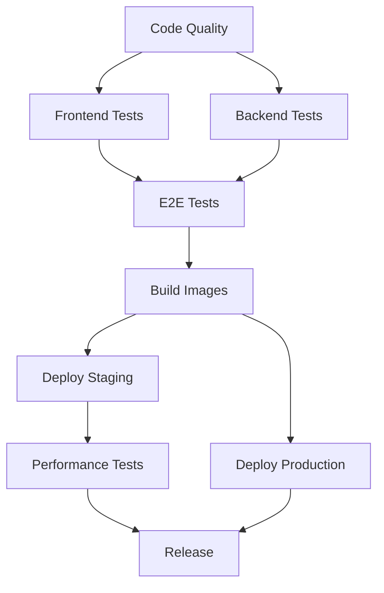

# GitHub Actions CI/CD Pipeline Documentation

This document describes the comprehensive CI/CD pipeline setup for the Sterling Auctions project using GitHub Actions.

## 🚀 Pipeline Overview

The CI/CD pipeline consists of multiple workflows that handle different aspects of the development lifecycle:

1. **Main CI/CD Pipeline** (`ci-cd.yml`) - Core build, test, and deployment
2. **E2E Testing** (`e2e-tests.yml`) - End-to-end testing across browsers
3. **Security Scanning** (`security.yml`) - Security vulnerability scanning
4. **Performance Testing** (`performance.yml`) - Performance and load testing
5. **Release Management** (`release.yml`) - Automated releases
6. **Dependency Updates** (`dependencies.yml`) - Automated dependency updates

## 📋 Workflow Details

### 1. Main CI/CD Pipeline (`ci-cd.yml`)

**Triggers:**
- Push to `master` or `develop` branches
- Pull requests to `master` or `develop` branches
- Release events

**Jobs:**
- **Code Quality Analysis**: TypeScript checking, ESLint, .NET formatting
- **Frontend Tests**: Unit tests with coverage reporting
- **Backend Tests**: NUnit tests with PostgreSQL service
- **E2E Tests**: Playwright tests with Docker environment
- **Build Images**: Docker image building and pushing to GHCR
- **Deploy to Staging**: AWS ECS deployment (develop branch)
- **Deploy to Production**: AWS ECS deployment (master branch)
- **Performance Tests**: Lighthouse CI and Artillery load testing

### 2. E2E Testing (`e2e-tests.yml`)

**Triggers:**
- Push to `master`, `develop` branches
- Pull requests to `master`, `develop` branches
- Manual dispatch

**Features:**
- Multi-browser testing (Chrome, Firefox, Safari, Edge)
- Mobile device testing (Mobile Chrome, Mobile Safari)
- Parallel test execution
- Test result artifacts
- Screenshot and video capture on failure

### 3. Security Scanning (`security.yml`)

**Triggers:**
- Push to `master`, `develop` branches
- Pull requests to `master`, `develop` branches
- Weekly schedule (Monday 2 AM)

**Security Checks:**
- **Dependency Vulnerability Scan**: npm audit, .NET security audit
- **CodeQL Analysis**: Static code analysis for C# and JavaScript
- **Docker Security Scan**: Trivy vulnerability scanning
- **Secrets Scanning**: TruffleHog for exposed secrets
- **SAST Scan**: Semgrep security audit
- **License Compliance**: License compatibility checking

### 4. Performance Testing (`performance.yml`)

**Triggers:**
- Push to `master`, `develop` branches
- Pull requests to `master`, `develop` branches
- Weekly schedule (Sunday 3 AM)

**Performance Tests:**
- **Lighthouse CI**: Web performance auditing
- **Load Testing**: Artillery load testing
- **Stress Testing**: High-load stress testing
- **Memory Profiling**: Memory usage analysis
- **Bundle Analysis**: Frontend bundle size analysis
- **API Performance**: k6 API performance testing

### 5. Release Management (`release.yml`)

**Triggers:**
- Git tags (v*)
- Manual dispatch with version input

**Release Process:**
- **Create Release**: GitHub release with changelog
- **Build and Push**: Docker image building and registry push
- **Update Assets**: Deployment package creation
- **Notifications**: Slack/Discord release notifications

### 6. Dependency Updates (`dependencies.yml`)

**Triggers:**
- Weekly schedule (Monday 9 AM)
- Manual dispatch

**Update Process:**
- **Update Dependencies**: npm and .NET package updates
- **Security Updates**: High-priority security fixes
- **Pull Request Creation**: Automated PR creation for updates
- **Notifications**: Success/failure notifications

## 🔧 Configuration

### Environment Variables

```yaml
env:
  REGISTRY: ghcr.io
  IMAGE_NAME: ${{ github.repository }}
  NODE_VERSION: '18'
  DOTNET_VERSION: '9.0.x'
```

### Required Secrets

The following secrets must be configured in the repository settings:

#### AWS Deployment
- `AWS_ACCESS_KEY_ID`: AWS access key for deployment
- `AWS_SECRET_ACCESS_KEY`: AWS secret key for deployment

#### Security Scanning
- `SNYK_TOKEN`: Snyk security scanning token
- `SEMGREP_APP_TOKEN`: Semgrep SAST scanning token

#### Notifications
- `SLACK_WEBHOOK_URL`: Slack webhook for notifications
- `DISCORD_WEBHOOK_URL`: Discord webhook for notifications

#### Code Coverage
- `CODECOV_TOKEN`: Codecov token for coverage reporting

### Branch Protection Rules

Recommended branch protection settings:

```yaml
# master branch
- Require pull request reviews (2 reviewers)
- Require status checks to pass before merging
- Require branches to be up to date before merging
- Require linear history
- Restrict pushes that create files larger than 100MB

# develop branch
- Require pull request reviews (1 reviewer)
- Require status checks to pass before merging
- Allow force pushes
```

## 🚦 Pipeline Stages

### 1. Code Quality Stage
- TypeScript compilation check
- ESLint code quality check
- Prettier formatting check
- .NET code formatting check
- Security vulnerability scanning

### 2. Testing Stage
- Frontend unit tests with coverage
- Backend unit tests with coverage
- E2E tests across multiple browsers
- Mobile device testing
- Integration tests

### 3. Build Stage
- Frontend build optimization
- Backend compilation
- Docker image building
- Container registry push
- Artifact generation

### 4. Deployment Stage
- Staging environment deployment
- Production environment deployment
- Health checks and rollback capability
- Blue-green deployment strategy

### 5. Monitoring Stage
- Performance testing
- Security scanning
- Dependency updates
- Release notifications

## 📊 Artifacts and Reports

### Test Artifacts
- **Playwright Reports**: HTML test reports with screenshots/videos
- **Coverage Reports**: Code coverage in multiple formats
- **Performance Results**: Lighthouse and load testing results
- **Security Reports**: Vulnerability scan results

### Build Artifacts
- **Docker Images**: Multi-architecture container images
- **Release Packages**: Deployment-ready packages
- **Bundle Analysis**: Frontend bundle size analysis

## 🔄 Workflow Dependencies



## 🛠️ Local Development

### Running Workflows Locally

```bash
# Install act (GitHub Actions runner)
npm install -g @nektos/act

# Run specific workflow
act -j code-quality

# Run with secrets
act --secret-file .secrets

# Run with environment variables
act --env-file .env
```

### Testing Workflow Changes

```bash
# Validate workflow syntax
act --list

# Dry run workflow
act --dry-run

# Run with specific event
act push --eventpath .github/workflows/ci-cd.yml
```

## 📈 Monitoring and Alerts

### Success Metrics
- Build success rate
- Test pass rate
- Deployment success rate
- Security scan pass rate

### Failure Alerts
- Build failures
- Test failures
- Security vulnerabilities
- Performance regressions

### Notification Channels
- **Slack**: Development team notifications
- **Discord**: Community notifications
- **Email**: Critical failure alerts
- **GitHub**: Issue creation for failures

## 🔧 Troubleshooting

### Common Issues

1. **Build Failures**
   - Check dependency versions
   - Verify environment variables
   - Review build logs

2. **Test Failures**
   - Check test environment setup
   - Verify test data
   - Review test logs and screenshots

3. **Deployment Failures**
   - Check AWS credentials
   - Verify ECS service configuration
   - Review deployment logs

4. **Security Scan Failures**
   - Review vulnerability reports
   - Update vulnerable dependencies
   - Check license compliance

### Debug Commands

```bash
# Check workflow status
gh run list --workflow=ci-cd.yml

# View workflow logs
gh run view <run-id>

# Download artifacts
gh run download <run-id>

# Rerun failed jobs
gh run rerun <run-id>
```

## 📚 Best Practices

### Workflow Design
- Use matrix strategies for parallel execution
- Implement proper error handling
- Use caching for dependencies
- Set appropriate timeouts

### Security
- Use least-privilege secrets
- Rotate secrets regularly
- Scan for exposed credentials
- Use dependency scanning

### Performance
- Parallel job execution
- Efficient caching strategies
- Optimized Docker builds
- Resource management

### Maintenance
- Regular dependency updates
- Workflow optimization
- Documentation updates
- Monitoring and alerting

## 🚀 Future Enhancements

### Planned Features
- **Multi-environment Support**: Dev, staging, production
- **Feature Flags**: Environment-specific feature toggles
- **Database Migrations**: Automated schema updates
- **Rollback Capability**: Automated rollback on failures
- **Cost Optimization**: Resource usage optimization
- **Advanced Monitoring**: Custom metrics and dashboards

### Integration Opportunities
- **Slack Integration**: Rich notifications and commands
- **Jira Integration**: Issue tracking and project management
- **SonarQube**: Advanced code quality analysis
- **Datadog**: Application performance monitoring
- **PagerDuty**: Incident management and alerting

---

This CI/CD pipeline provides comprehensive automation for the Sterling Auctions project, ensuring code quality, security, performance, and reliable deployments across all environments.
